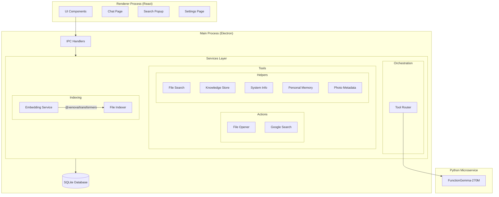
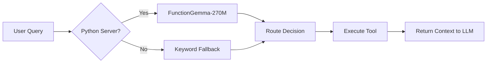
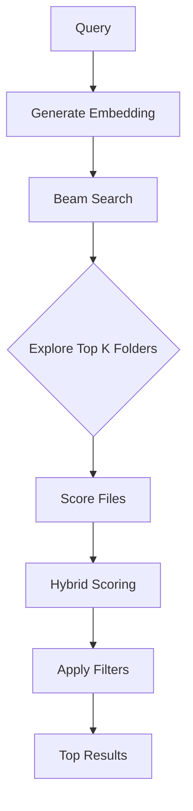
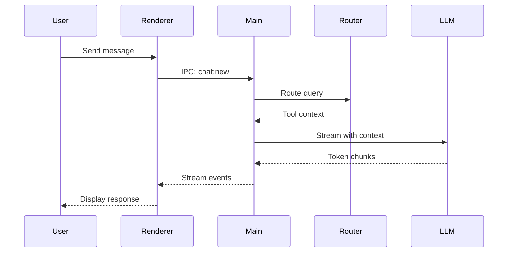

# FUNCTION.md - Kel Architecture Deep Dive

> A comprehensive guide to how Kel works under the hood

---

## Overview

**Kel** is an AI-powered desktop assistant that lives on your computer. Built as an Electron application with a React/TypeScript frontend, it provides intelligent file search, system information queries, web search, and conversational AI—all running locally with optional cloud AI support.

### Key Technologies

| Layer | Technology |
|-------|------------|
| Desktop Framework | Electron |
| Frontend | React 19 + TypeScript + Tailwind CSS 4 |
| Database | SQLite via Drizzle ORM |
| AI Routing | Python microservice (FunctionGemma-270M) |
| AI Chat | OpenRouter / Ollama (local LLMs) |
| Embeddings | Transformers.js (@xenova/transformers) |

---

## Architecture Diagram



---

## Directory Structure

```
kel/
├── src/
│   ├── main/                    # Electron main process
│   │   ├── index.ts             # App entry point, window management
│   │   ├── preload.ts           # Preload script for IPC bridge
│   │   ├── api/                 # IPC handlers
│   │   │   ├── ai/              # AI streaming & chat handlers
│   │   │   ├── chat/            # Chat CRUD operations
│   │   │   ├── message/         # Message CRUD operations
│   │   │   ├── semantic/        # File search API
│   │   │   └── settings/        # Settings management
│   │   ├── db/                  # Database layer
│   │   │   ├── index.ts         # Database connection
│   │   │   ├── schema.ts        # Schema exports
│   │   │   └── tables/          # Table definitions
│   │   ├── lib/                 # Utility libraries
│   │   │   ├── openrouter.ts    # OpenRouter AI provider
│   │   │   └── ollama.ts        # Ollama local AI provider
│   │   └── services/            # Core business logic
│   │       ├── orchestration/   # AI routing
│   │       ├── tools/           # Tool implementations
│   │       └── indexing/        # File indexing
│   ├── preload/                 # Preload scripts
│   └── renderer/                # React frontend
│       └── src/
│           ├── components/      # UI components
│           ├── hooks/           # Custom React hooks
│           ├── routes/          # Page components
│           └── lib/             # Frontend utilities
├── python/                      # Python microservice
│   ├── function_gemma_server.py # FunctionGemma routing server
│   └── requirements.txt         # Python dependencies
├── drizzle/                     # Database migrations
└── public/                      # Static assets
```

---

## Core Components

### 1. Main Process (`src/main/index.ts`)

The Electron main process handles:

- **Window Management**: Creates main window + search popup
- **Tray Icon**: Menu bar icon for quick access
- **Global Shortcuts**: `Cmd+K` for search popup, `Cmd+Shift+K` for full window
- **IPC Registration**: Bridges frontend to backend services
- **Initialization**: Runs migrations, initializes services, indexes files

```typescript
// Key window types
let mainWindow: BrowserWindow | null = null    // Main chat window (sidebar)
let searchPopup: BrowserWindow | null = null   // Menu bar search popup
let tray: Tray | null = null                   // System tray icon
```

**Initialization Flow:**
1. Run database migrations
2. Initialize settings with defaults
3. Index semantic file system from Desktop
4. Initialize knowledge system (system info, photos, personal memory)
5. Register all IPC API handlers
6. Create windows and global shortcuts

---

### 2. Tool Router (`src/main/services/orchestration/tool-router.ts`)

The intelligent router that decides which tool to use for each query.

#### Three Meta-Tools

| Tool | Purpose | Targets |
|------|---------|---------|
| `local_query` | Query anything on the local computer | files, system, memory, apps, disk |
| `web_query` | Search the internet | weather, news, facts, prices, events |
| `conversation` | Normal chat without actions | greetings, thanks, help requests |

#### Routing Flow



#### Tool Arguments

The router extracts rich parameters from natural language:

```typescript
interface ToolArguments {
  query?: string           // Search terms
  intent?: 'find' | 'read' | 'open' | 'list' | 'analyze' | 'recall'
  target?: 'files' | 'system' | 'memory' | 'apps' | 'disk'
  file_types?: string[]    // ['pdf', 'image', 'document', ...]
  location?: string        // 'downloads', 'desktop', 'documents', ...
  date_range?: string      // 'today', 'week', 'month', 'year'
  metrics?: string[]       // For system queries: ['cpu', 'memory', 'disk', ...]
}
```

---

### 3. Python Microservice (`python/function_gemma_server.py`)

A lightweight HTTP server running Google's FunctionGemma-270M model for intelligent tool selection.

#### Endpoints

| Endpoint | Method | Purpose |
|----------|--------|---------|
| `/route` | POST | Route a query to the best tool |
| `/health` | GET | Health check |

#### Hybrid Routing Strategy

1. **Keyword Pre-Filter** (instant, <1ms):
   - Catches obvious queries using keyword matching
   - Handles system queries, web queries, casual chat, memory queries
   - Returns immediately without model inference

2. **FunctionGemma Model** (for complex queries):
   - Uses transformer model for nuanced understanding
   - Extracts structured parameters from natural language
   - Applies smart defaults based on query analysis

#### Keyword Categories

```python
SYSTEM_KEYWORDS = ["slow", "ram", "memory", "cpu", "storage", "battery", ...]
WEB_KEYWORDS = ["weather", "news", "stock", "who is", "how to", ...]
FILE_KEYWORDS = ["find", "open", "file", "document", "pdf", "my", ...]
CASUAL_KEYWORDS = ["hello", "thanks", "help", "what can you do", ...]
MEMORY_KEYWORDS = ["about me", "my favorite", "remember when", ...]
```

---

### 4. File Search Service (`src/main/services/tools/helpers/file-search.ts`)

Semantic file search using beam search with hybrid scoring.

#### Hybrid Scoring Formula

```
finalScore = (FILENAME_WEIGHT × filenameScore) + 
             (CONTENT_WEIGHT × contentScore) + 
             (KEYWORD_WEIGHT × keywordScore)

Where:
- FILENAME_WEIGHT = 0.35
- CONTENT_WEIGHT = 0.40  
- KEYWORD_WEIGHT = 0.25
```

#### Search Algorithm

1. **Embed Query**: Convert query to vector using Transformers.js
2. **Beam Search**: Explore multiple folder paths simultaneously
3. **Filter Application**: Apply file type, location, date filters
4. **Hybrid Scoring**: Combine filename, content, and keyword scores
5. **Threshold Filtering**: Only return results above MIN_RESULT_SCORE (0.35)



---

### 5. File Indexer (`src/main/services/indexing/file-indexer.ts`)

Builds the semantic file tree using bottom-up indexing.

#### Indexing Strategy

1. **Post-Order Traversal**: Index children before parents
2. **Folder Summaries**: Generate text summary of folder contents
3. **Aggregate Embeddings**: Folder embedding = mean of child embeddings
4. **Batch Processing**: Process files in batches of 100 for efficiency

#### Ignored Directories

```typescript
const SKIP_DIRS = [
  'node_modules', '.git', '__pycache__', 'dist', 'build',
  '.next', '.nuxt', '.cache', '.idea', '.vscode', ...
]
```

---

### 6. Knowledge Store (`src/main/services/tools/helpers/knowledge-store.ts`)

Hierarchical knowledge tree using k-means clustering for efficient semantic search.

#### Knowledge Domains

| Domain | Content | Source |
|--------|---------|--------|
| `computer` | System specs, installed apps, storage | System scraper |
| `photos` | Photo descriptions and metadata | Photo indexer |
| `personal` | User preferences, facts about the user | LLM inference, user input |

#### Tree Structure

```
Root Node (depth 0)
├── Cluster 1 (depth 1)
│   ├── Cluster 1.1 (depth 2)
│   │   └── Leaf items...
│   └── Cluster 1.2 (depth 2)
│       └── Leaf items...
└── Cluster 2 (depth 1)
    └── Leaf items...
```

#### Clustering Configuration

```typescript
const CLUSTER_CONFIG = {
  L1_TARGET: 10,      // 8-12 items at level 1
  L2_TARGET: 15,      // 10-20 items at level 2+
  MIN_LEAF_SIZE: 10,  // Don't split clusters smaller than this
  MAX_LEAF_SIZE: 50,  // Must split clusters larger than this
  MAX_DEPTH: 4        // Maximum tree depth
}
```

---

### 7. Embedding Service (`src/main/services/indexing/embedding.ts`)

Generates text embeddings using Transformers.js with the "all-MiniLM-L6-v2" model.

#### Model Details

- **Model**: `Xenova/all-MiniLM-L6-v2`
- **Dimensions**: 384
- **Pooling**: Mean pooling
- **Normalization**: L2 normalized

---

### 8. AI Handlers (`src/main/api/ai/handlers.ts`)

Manages AI chat streaming with tool context injection.

#### Chat Flow



#### Memory Extraction

The LLM can extract memories using special tags:

```xml
<memory>User prefers dark mode</memory>
```

These are automatically parsed and stored in the personal memory system.

#### Supported AI Providers

| Provider | Model Prefix | Example |
|----------|--------------|---------|
| OpenRouter | (none) | `anthropic/claude-3-sonnet` |
| Ollama | `ollama/` | `ollama/phi3.5:latest` |

---

## Database Schema

### Tables

#### `chat`
```sql
id       INTEGER PRIMARY KEY
title    TEXT
createdAt TIMESTAMP
```

#### `message`
```sql
id       INTEGER PRIMARY KEY
chatId   INTEGER (FK → chat.id)
role     TEXT ('user' | 'assistant')
content  TEXT
createdAt TIMESTAMP
```

#### `semantic_folders`
```sql
id        INTEGER PRIMARY KEY
path      TEXT UNIQUE
parentId  INTEGER
name      TEXT
depth     INTEGER
summary   TEXT
embedding BLOB (Float32Array)
fileCount INTEGER
indexedAt TIMESTAMP
```

#### `semantic_files`
```sql
id               INTEGER PRIMARY KEY
folderId         INTEGER (FK → semantic_folders.id)
path             TEXT UNIQUE
name             TEXT
embedding        BLOB (filename embedding)
contentSignature TEXT (first ~500 chars)
contentEmbedding BLOB (content embedding)
extension        TEXT
indexedAt        TIMESTAMP
```

#### `knowledge_nodes`
```sql
id        INTEGER PRIMARY KEY
parentId  INTEGER
domain    TEXT ('photos' | 'computer' | 'personal')
depth     INTEGER
embedding BLOB
itemCount INTEGER
label     TEXT
createdAt TIMESTAMP
updatedAt TIMESTAMP
```

#### `knowledge_items`
```sql
id          INTEGER PRIMARY KEY
nodeId      INTEGER (FK → knowledge_nodes.id)
domain      TEXT
content     TEXT
embedding   BLOB
sourceType  TEXT ('file' | 'system' | 'inferred' | 'user')
sourcePath  TEXT
confidence  REAL (0-1)
accessCount INTEGER
createdAt   TIMESTAMP
```

#### `settings`
```sql
key   TEXT PRIMARY KEY
value TEXT
```

---

## Frontend Components

### Main Pages

| Page | Path | Purpose |
|------|------|---------|
| Home | `/` | Welcome screen with recent chats |
| Chat | `/chat/:id` | Chat conversation view |
| Settings | `/settings` | Model selection, API keys |
| Search Popup | (overlay) | Quick search from menu bar |

### Key Components

- **`Titlebar`**: Draggable window header with controls
- **`ComposeMessage`**: Chat input with submit handling
- **`MessageContent`**: Markdown rendering with KaTeX support
- **`ModelSelector`**: Dropdown for switching AI models
- **`Greeting`**: Welcome message component

---

## Global Shortcuts

| Shortcut | Action |
|----------|--------|
| `Cmd/Ctrl+K` | Toggle search popup |
| `Cmd/Ctrl+Shift+K` | Show full window |

---

## Running the Application

### Prerequisites

1. Node.js 18+
2. pnpm
3. Python 3.9+ (for FunctionGemma server)

### Development

```bash
# Install dependencies
pnpm install

# Start Python routing server (in separate terminal)
cd python
pip install -r requirements.txt
python function_gemma_server.py

# Start Electron app
pnpm dev
```

### Building

```bash
pnpm build:mac    # macOS
pnpm build:win    # Windows
pnpm build:linux  # Linux
```

### Database Commands

```bash
pnpm db:generate  # Generate migrations from schema
pnpm db:migrate   # Run migrations
pnpm db:push      # Push schema changes directly
pnpm db:studio    # Open Drizzle Studio UI
```

---

## Data Flow Summary

1. **User Input** → Search popup or chat interface
2. **IPC Bridge** → Message sent to main process
3. **Tool Router** → FunctionGemma determines best tool
4. **Tool Execution** → Gather relevant context (files, system info, web results)
5. **LLM Streaming** → Context-enriched prompt sent to AI
6. **Response** → Streamed back to UI with potential memory extraction
7. **Storage** → Messages saved to database, memories stored in knowledge tree

---

## Configuration

### Environment Variables (`.env`)

```bash
OPENROUTER_API_KEY=your-key-here
GOOGLE_API_KEY=your-google-api-key
GOOGLE_SEARCH_ENGINE_ID=your-search-engine-id
```

### Default Settings

- Selected Model: `anthropic/claude-3-haiku` (via OpenRouter)
- Window Position: Right side of screen
- Python Server Port: 8765

---

## Summary

Kel is a sophisticated local-first AI assistant that:

1. **Routes intelligently** using FunctionGemma-270M with keyword pre-filtering
2. **Indexes semantically** using hierarchical embeddings for fast file search
3. **Stores knowledge** in clustered trees for efficient retrieval
4. **Remembers context** through automatic memory extraction from conversations
5. **Runs locally** with optional cloud AI backends

The architecture prioritizes speed and privacy by processing as much as possible on-device while maintaining flexibility for cloud AI integration when needed.
